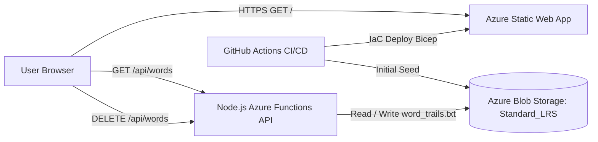

DO NOT ADD @word_trails.txt TO CONTEXT, it is a sorted list of almost 370,000 english words, 1 on each line.

## Overview
**Word Finder** is a serverless web application that assists players in word games by finding and filtering valid words matching available letters, length, and positional constraints. It includes live interactive word filtering, word dimming, atomic word deletion, and cloud hosting on Azure.

---

## Architecture

1. **Storage Tier**:
   - **Azure Blob Storage (Standard_LRS / StorageV2)** in a private container (`words`).
   - Cheapest mutable storage for the ~370,000-word dataset (~3.5 MB, <$0.0001/month).
2. **Backend API Tier**:
   - **Azure Functions (Node.js v4 programming model)** integrated seamlessly via Azure Static Web Apps.
   - `GET /api/words`: Streams the word list from Blob Storage with caching headers (`Cache-Control: public, max-age=60, stale-while-revalidate=300`). Falls back to local `word_trails.txt` during offline/local development.
   - `DELETE /api/words`: Removes a specified word from the stored blob atomically with JSON or query param payload `{ "word": "target" }`.
3. **Frontend UI Tier**:
   - [public/index.html](public/index.html), [public/styles.css](public/styles.css), and [public/script.js](public/script.js) hosted on Azure Static Web Apps (Free tier).
   - Filters words by:
     - `letters-input`: Available letter bag (respecting letter frequency).
     - `length-slider`: Target word length.
     - `position-filters`: Exact letter constraints per position.
   - Word tags can be clicked to toggle dimming, or deleted permanently by clicking the hover delete button (`×`).
   - Supports Light, Dark, and System theme modes.
4. **CI/CD & Infrastructure as Code**:
   - Workload Bicep definition in [infra/main.bicep](infra/main.bicep) and parameters in [infra/main.bicepparam](infra/main.bicepparam).
   - Deployment identity Bicep definition in [infra/identity.bicep](infra/identity.bicep) and parameters in [infra/identity.bicepparam](infra/identity.bicepparam).
   - GitHub Actions authenticates via a user-assigned managed identity with a GitHub OIDC federated credential (provisioned separately via [infra/identity.bicep](infra/identity.bicep)), no app registration/service principal secrets.
   - GitHub Actions workflow in [.github/workflows/azure-deploy.yml](.github/workflows/azure-deploy.yml) for automated infrastructure provisioning, initial blob seeding, and static site + function deployment.

---

## Project Structure

- [public/index.html](public/index.html) — Main static web application markup.
- [public/styles.css](public/styles.css) — Frontend styles (theming, layout, word tags).
- [public/script.js](public/script.js) — Frontend logic (filtering, theme toggle, word deletion).
- `word_trails.txt` — Source sorted list of ~370,000 English words (used for initial seed); symlinked as `public/word_trails.txt` for local offline fallback.
- [.devcontainer/devcontainer.json](.devcontainer/devcontainer.json) — Dev container specification with Node 24, Azure CLI + Bicep, Functions Core Tools, SWA CLI, and Azurite.
- [public/staticwebapp.config.json](public/staticwebapp.config.json) — Azure Static Web Apps routing and configuration.
- [infra/identity.bicep](infra/identity.bicep) — Azure Bicep template provisioning GitHub Actions user-assigned managed identity, OIDC federated credential, and Contributor role assignment.
- [infra/identity.bicepparam](infra/identity.bicepparam) — Parameter values for identity Bicep deployment.
- [infra/main.bicep](infra/main.bicep) — Declarative Azure Bicep template provisioning Storage Account, blob container, and Static Web App.
- [infra/main.bicepparam](infra/main.bicepparam) — Parameter values for workload Bicep deployment.
- [api/host.json](api/host.json) — Azure Functions host configuration.
- [api/package.json](api/package.json) — Node.js dependencies (`@azure/functions`, `@azure/storage-blob`).
- [api/src/functions/words.js](api/src/functions/words.js) — Azure Function endpoints (`GET /api/words`, `DELETE /api/words`).
- [api/local.settings.json.example](api/local.settings.json.example) — Local environment variables and Azurite connection string.
- [.github/workflows/azure-deploy.yml](.github/workflows/azure-deploy.yml) — Automated GitHub Actions CI/CD deployment workflow.

## Required Validation After Changes

- After changing any Bicep file in [infra](infra), run lint before finishing work:
  - `az bicep lint --file infra/main.bicep`
  - `az bicep lint --file infra/identity.bicep`
- Fix any lint warnings or errors before considering the change complete.
- Never output secrets from Bicep templates; if a deployment secret is required, retrieve it through Azure tooling at runtime instead of exposing it as a template output.